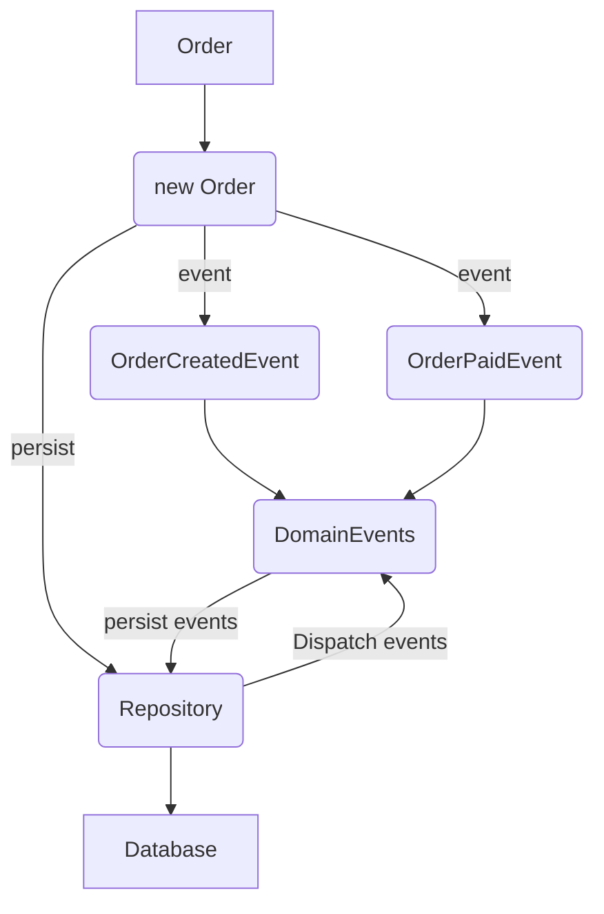

### DDD - Domain Events

#### Fluxograma



1. Criar uma `Order`;
2. Criar um evento respectivo a sua ação;
3. Salvar em banco de dados (Repositórios);
4. Disparar `DomainEvents` com o `id` da entidade;

#### Fluxograma em código

```ts
// src/infra/index.ts

// Subscriber
DomainEvents.registerSubscriber(OrderCreatedEvent.name, (order) => {
  console.log("order event", order);
});

// Subscriber
DomainEvents.registerSubscriber(OrderPaidEvent.name, (order) => {
  console.log("paid event", order);
});

// Publisher
const order = Order.create({
  customerId: "customer_id",
  productId: "product_id",
  amountInCents: 1000,
  status: "pending",
  createdAt: new Date(),
});

order.pay();

// Dentro da camada de persistência (repositório)
// Finalização do processo de venda
DomainEvents.dispatchEventsForEntity(order.id);
```
